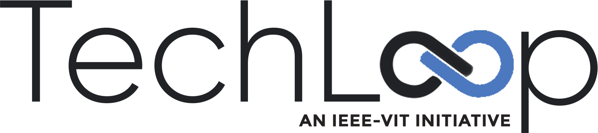

# Enigma - iOS
Official Enigma 6.0 App

### Introduction
Every year IEEE VIT SB host Enigma(a online cryptic hunt). The iOS application was used to register new user using Google sign-In and to play Enigma and also to check the leaderboard.

### Application Preview

## What is IEEE VIT SB?
 

 
IEEE VIT Core Committee is one of the most active chapters inside Region 10 of IEEE International. We boast of highly skilled members in technical and non-technical disciplines. The IEEE Region 10, also sometimes referred as the Asia Pacific Region, comprises of 57 Sections, 6 Councils, 17 Sub-sections, 515 Chapters, 60 Affinity Groups and 958 Student Branches. It covers a geographical area stretching from South Korea and Japan in the north-east to New Zealand in the south, and Pakistan in the west. With over 100,000 members it is one of the largest regions in IEEE.

## What is techloop?
 

 
A one of its kind initiative from IEEE VIT that seeks to proliferate technical skills among students. Topics discussed include
<ul>
<li>Electronics
<li>Machine Learning
<li>Application Development
<li>Web Development
<li>Design
<li>Cyber Security
</ul>

MIT License

Copyright (c) 2019 Devang Patel on behalf of IEEE VIT SB

Permission is hereby granted, free of charge, to any person obtaining a copy
of this software and associated documentation files (the "Software"), to deal
in the Software without restriction, including without limitation the rights
to use, copy, modify, merge, publish, distribute, sublicense, and/or sell
copies of the Software, and to permit persons to whom the Software is
furnished to do so, subject to the following conditions:

The above copyright notice and this permission notice shall be included in all
copies or substantial portions of the Software.

THE SOFTWARE IS PROVIDED "AS IS", WITHOUT WARRANTY OF ANY KIND, EXPRESS OR
IMPLIED, INCLUDING BUT NOT LIMITED TO THE WARRANTIES OF MERCHANTABILITY,
FITNESS FOR A PARTICULAR PURPOSE AND NONINFRINGEMENT. IN NO EVENT SHALL THE
AUTHORS OR COPYRIGHT HOLDERS BE LIABLE FOR ANY CLAIM, DAMAGES OR OTHER
LIABILITY, WHETHER IN AN ACTION OF CONTRACT, TORT OR OTHERWISE, ARISING FROM,
OUT OF OR IN CONNECTION WITH THE SOFTWARE OR THE USE OR OTHER DEALINGS IN THE
SOFTWARE.
