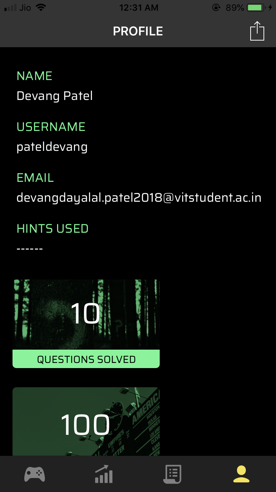

# Enigma - iOS
Official Enigma 6.0 App

### Introduction
Every year IEEE VIT SB host Enigma(a online cryptic hunt). The iOS application was used to register new user using Google sign-In and to play Enigma and also to check the leaderboard.

### Application Preview

